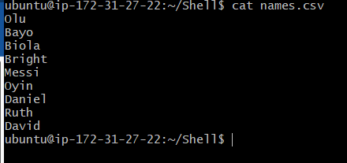
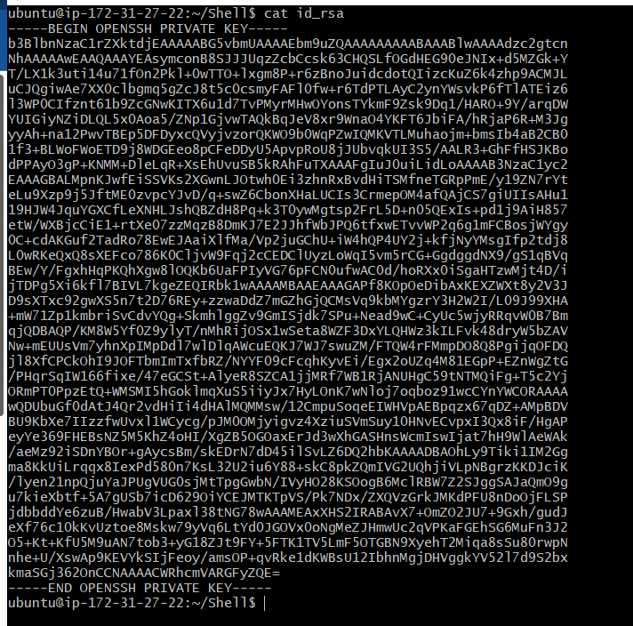
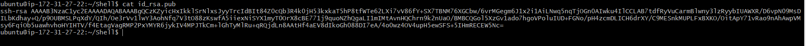

## AUX PROJECT 1: SHELL SCRIPTING

In this project, I created onboard 20 new Linux users onto a server. Created a shell script that reads a csv file that contains the first name of the users to be onboarded.

1. *Create the project folder called Shell*
   >mkdir Shell

     *Move into the Shell folder*

    >cd Shell

2. *Create a csv file name names.csv*

    >touch names.csv

    *Open the names.csv file*

     >vim names.csv

Note: Shell Script 

##### onboarding.sh

A. After I created the script to read the CSV file:

B. Each user on the server, added to an existing group called developers.

C. I Ensure that the script will first check for the existence of the user on the system, before it will attempt to create that it.

D. I Ensure that the user that is being created also has a default home folder.

E. I Ensure that each user has a .ssh folder within its HOME folder.

F. For each user’s, the SSH configuration, I created an authorized_keys file and add ensxure it has the public key for the current user.

Before Deploying my script, I updated the current user with the correct public key and private key.

Home directory .ssh folder

> cd .ssh

create a file for the public key

> touch id_rsa.pub

open the file using your favorite editor and paste in the public key

> vi id_rsa.pub

create a file for your private key

> touch id_rsa

open the file using your favorite editor and paste in the private key.

> vi id_rsa

The Public Key

Note:

## Test a few of the users randomly, and ensure that you are able to connect to the server using the private key and the public key.

### USER - Olu

Test a few of the users randomly, and ensure that you are able to connect to the server using the private key and the public key.

### USER Biola

### USER Bright

